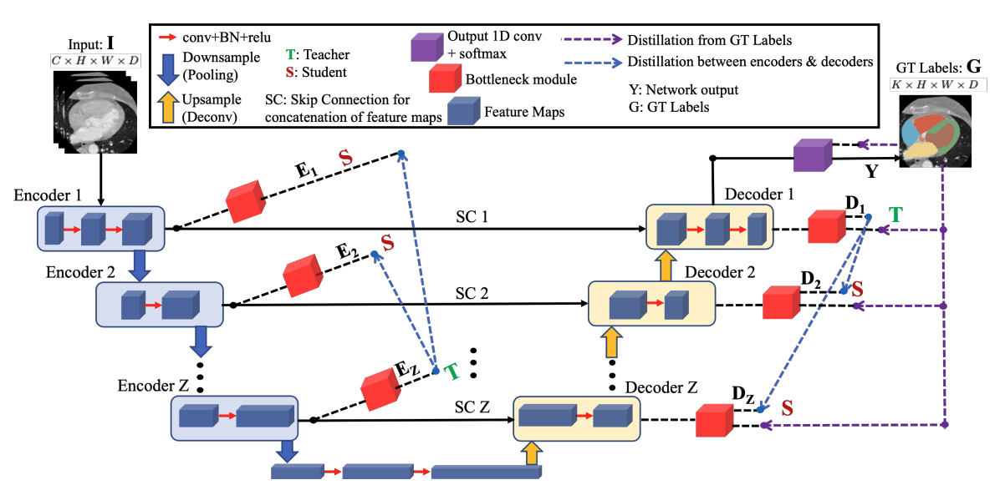

# Dual self-distillation (DSD) of U-shaped networks for 3D medical image segmentation


This is the official PyTorch implementation of the paper "[Dual self-distillation (DSD) of U-shaped networks for 3D medical image segmentation](https://ieeexplore.ieee.org/abstract/document/10635393)" that was published in "IEEE ISBI 2024 (Best Paper Award Nominee)" conference and **Volumetric medical image segmentation through dual self-distillation in U-shaped networks** that was published in **IEEE Transactions on Biomedical Engineering (TBME)** journal, 2025.

## Requirements
* Python >= 3.9
* [Monai](https://monai.io) >= 0.9.0
* [PyTorch](https://pytorch.org) >= 1.12.0
* [torchmanager](https://github.com/kisonho/torchmanager) >= 1.1.0

## Get Started
The following steps are required to replicate our work:

1. Download datasets.
* Cardiac Dataset (MM-WHS) - Download the [Multi-Modality Whole Heart Segmentation Dataset](https://zmiclab.github.io/zxh/0/mmwhs/). This dataset consists of the cardiac CT images and ground-truth segmentations labels of the different cardiac sub-structures of 20 patients.
* MSD Dataset (MSD-BraTS) - Download the Brain Tumor dataset (Task 01) from the [Medical Segmentation Decathlon](http://medicaldecathlon.com/). This dataset consists of multisite MRI data with 4 input modalities: FLAIR, T1w, T1gd,T2w and the ground-truth segmentation labels of the brain tumor of 484 patients.

2. Preprocessing of data.
* Cardiac Dataset (MM-WHS) - The preprocessing steps are provided inside the `data/challenge.py` file. It divides the 20 patients into training (16 patients) and validation (4 patients) with the option of 5-fold cross-validation. It then performs all the preprocessing steps necessary to train and validate both the basic U-shaped network and U-shaped network with DSD. 
* MSD Dataset (MSD-BraTS) - The preprocessing steps are provided inside the `data/MSD_loadBraTS.py` file. It divides the 484 patients into training (388 patients), validation (72 patients) and testing (24 patients). It then performs all the preprocessing steps necessary to train, validate and test both the basic U-shaped network and U-shaped network with DSD.

## Training

1. Refer to the training configuration file `configs/train.py` for the default hyper-parameters.

2. Train the basic U-shaped network as follows:
```
python train_basic.py /Path/to/BrainTumor/Data/Data_MSD_BraTS _ --img_size 128 128 128 --batch_size 1 --epochs 325 --experiment multimodalMR_MSD_BraTS_SwinUNETR_Basic.exp --training_split 24 --device cuda:0 --show_verbose

python train_basic.py /Path/to/MMWHS/Data/Data_MMWHS_All/CT _ --img_size 96 96 96 --batch_size 1 --epochs 600 --experiment CT_MMWHS_UNETR_Basic_Fold1.exp --training_split 4 --device cuda:0 --show_verbose
```
3. Train the U-shaped network with DSD as follows:
```
python train_SelfDistil_Original.py /Path/to/BrainTumor/Data/Data_MSD_BraTS _ --img_size 128 128 128 --batch_size 1 --epochs 325 --experiment multimodalMR_MSD_BraTS_SwinUNETR_SelfDist_Original.exp --training_split 24 --device cuda:0 --show_verbose

python train_SelfDistil_Original.py /Path/to/MMWHS/Data/Data_MMWHS_All/CT _ --img_size 96 96 96 --batch_size 1 --epochs 600 --experiment CT_MMWHS_UNETR_SelfDist_Original_Fold1.exp --training_split 4 --device cuda:0 --show_verbose
```

## Testing

1. The pre-trained models are stored in `experiments/` folder. For example: the pretrained model for SwinUNETR with DSD framework attached (with MSD-BraTS data) will be stored in the folder `experiments/multimodalMR_MSD_BraTS_SwinUNETR_SelfDist_Original.exp`.
* The pretrained models are not included in this GitHub repository due to space limitations. It will be made available after the review period through a DropBox link.
* Please include the path to the pretrained model inside the `eval.py` file for the testing.

2. Test the model
```
# For testing the models
python eval.py
```
* The settings such as modality, dataset, pretrained model path, fold number could be changed inside the `eval.py` file to get the desired results.


