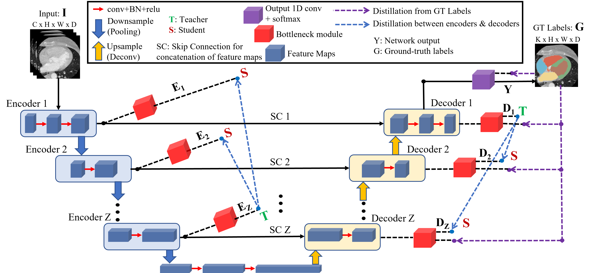

# Dual self-distillation (DSD) of U-shaped networks for 3D medical image segmentation

This is the official PyTorch implementation of the paper **Dual self-distillation (DSD) of U-shaped networks for 3D medical image segmentation** that was submitted to IEEE Transactions on Medical Imaging (TMI) journal and is currently under review.

## Requirements
* Python >= 3.9
* [Monai](https://monai.io) >= 0.9.0
* [PyTorch](https://pytorch.org) >= 1.12.0
* [torchmanager](https://github.com/kisonho/torchmanager) >= 1.1.0

## Get Started
The following steps are required to replicate our work:

1. Download datasets.
* Cardiac Dataset (MM-WHS) - Download the [Multi-Modality Whole Heart Segmentation Dataset](https://zmiclab.github.io/zxh/0/mmwhs/). This dataset consists of the CT cardiac images and ground-truth segmentations labels of the different cardiac sub-structures of 20 patients.
* MSD Dataset (MSD-BraTS) - Download the Brain Tumor dataset (Task 01) from the [Medical Segmentation Decathlon](http://medicaldecathlon.com/). This dataset consists of multisite MRI data with 4 input modalities: FLAIR, T1w, T1gd,T2w and the ground-truth segmentation labels of the brain tumor of 484 patients. 
